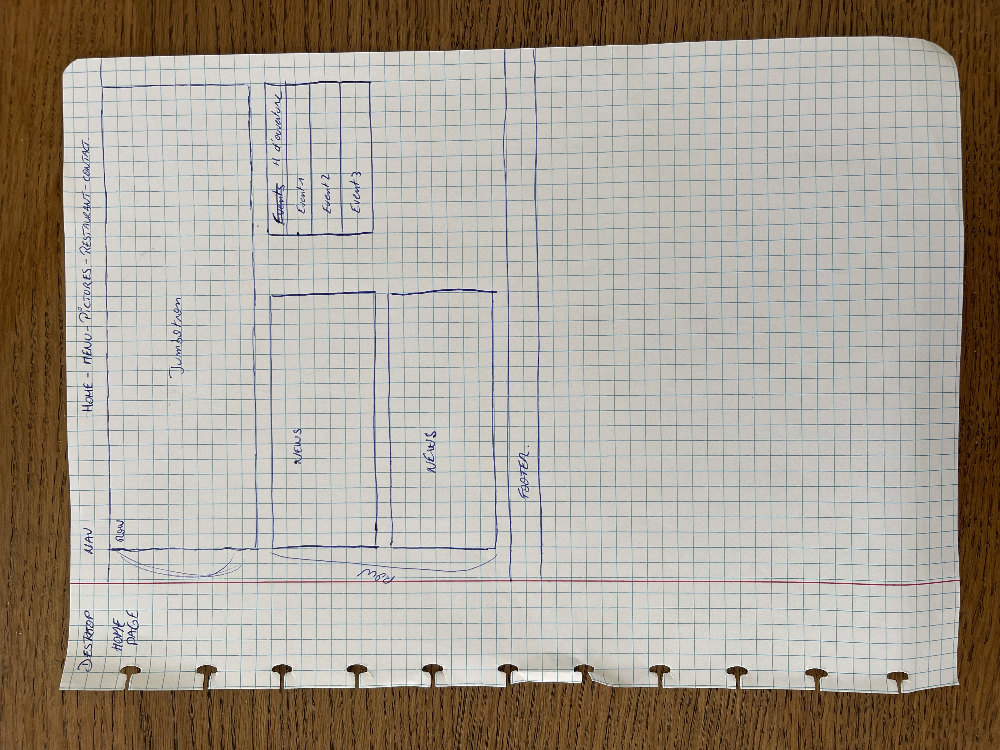
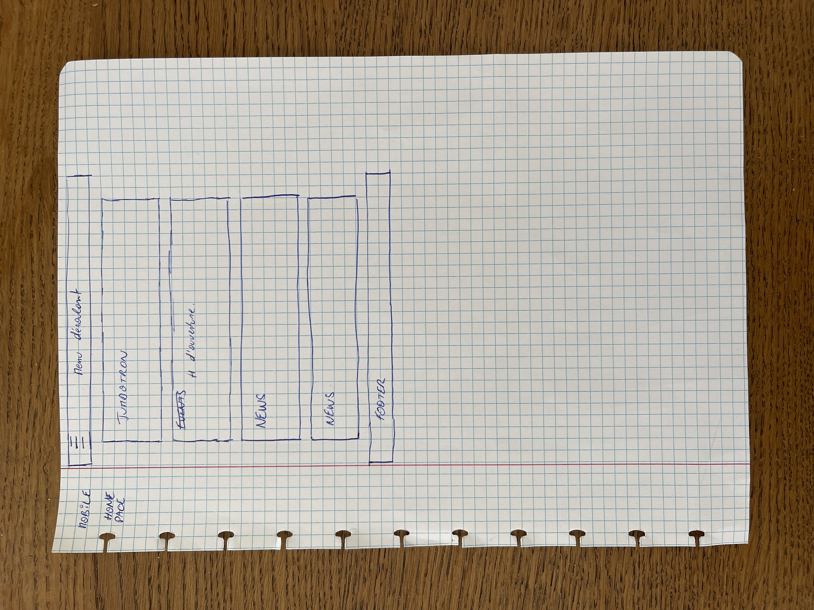
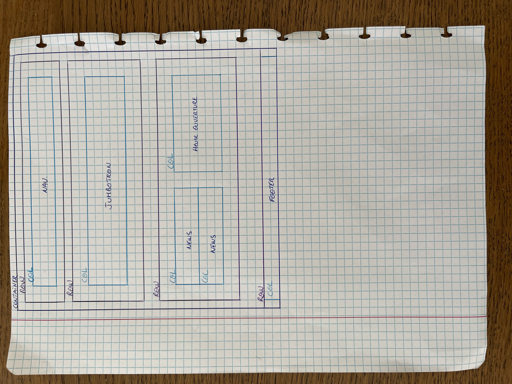

# Projet Restaurant (Burger House) - Boostrap
---

#### Consignes:

[BeCode GitHub Exercice](https://github.com/becodeorg/BXL-Swartz-5.34/blob/main/1.The-Field/10.Bootstrap/restaurant.adoc)

---

#### Language utilisé:

* HTML/CSS

#### Framework utilisé:

* Bootstrap

---

#### Développé par:

* [Nacer Samir](https://nass22.github.io)

---

#### Aperçu du site:

[Burger House](https://nass22.github.io/projet-resto/index.html)

---

#### Mes schémas:

* Schéma desktop:

* Schéma mobile:

* Schéma bootstrap:

---

#### Informations du site:

Ce site a été réalisé entièrement avec Boostrap. Afin de comprendre au mieux l'utilisation de Bootstrap, nous devions realiser un site pour un restaurant avec au minimum 5 pages actives et entièrement RESPONSIVE.
Site developpé au début de ma formation BeCode.

---

#### Ce site evoluera-t-il?

Certainement. Au fur et à mesure de notre formation, j'essaierai d'améliorer le site. 

---

### Sources:

* Images:
[Pixabay](https://www.pixabay.com)
* Icons:
[Icons8](https://icons8.com/)

